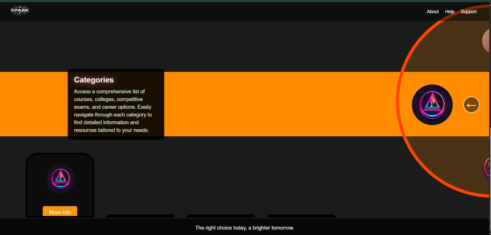
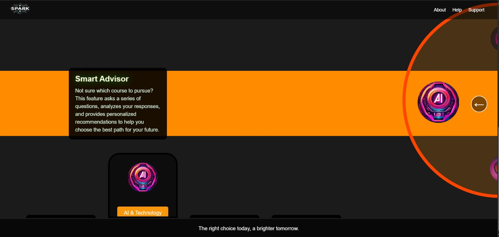
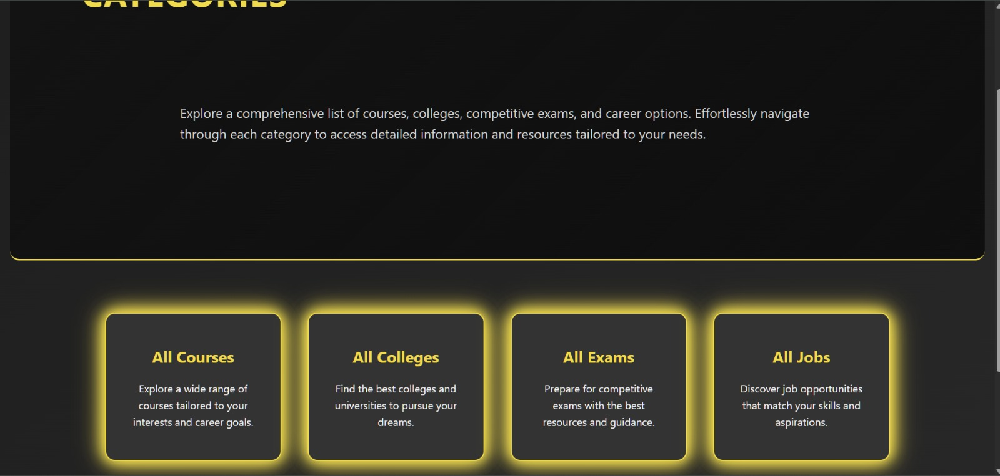
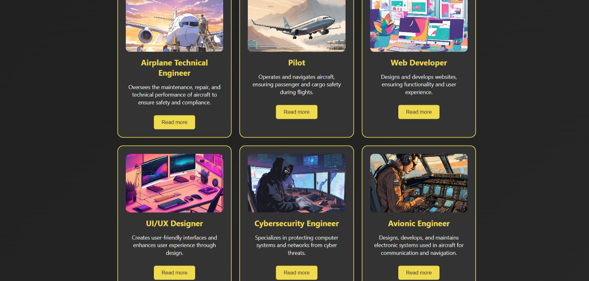
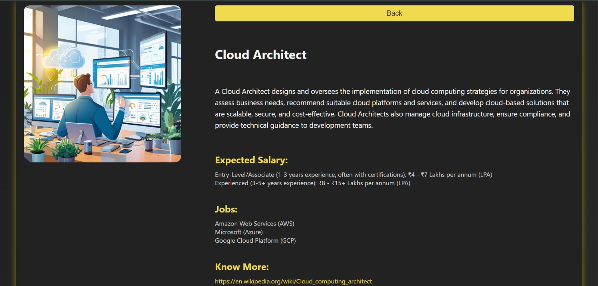
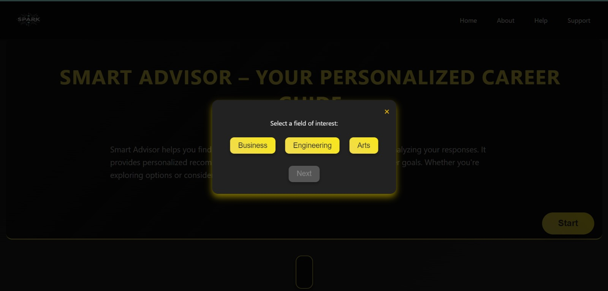
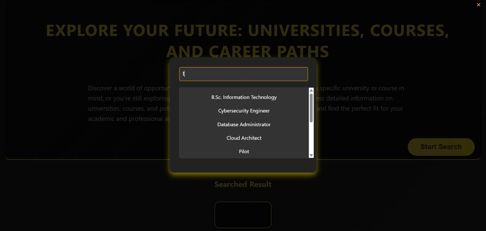
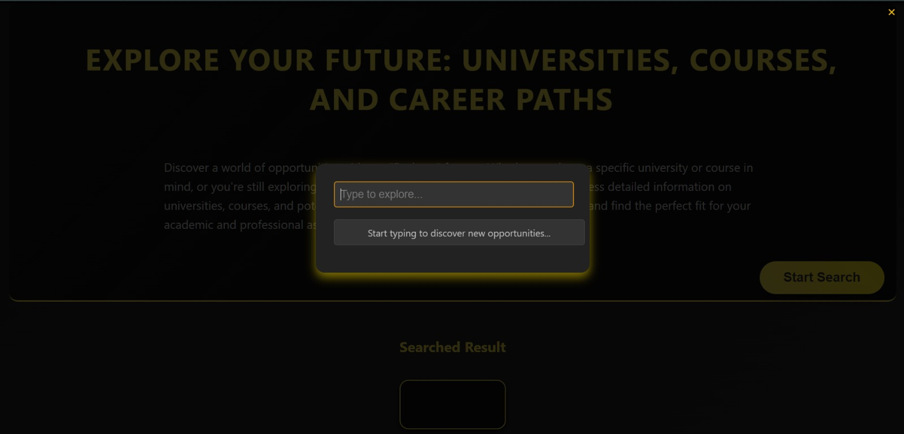
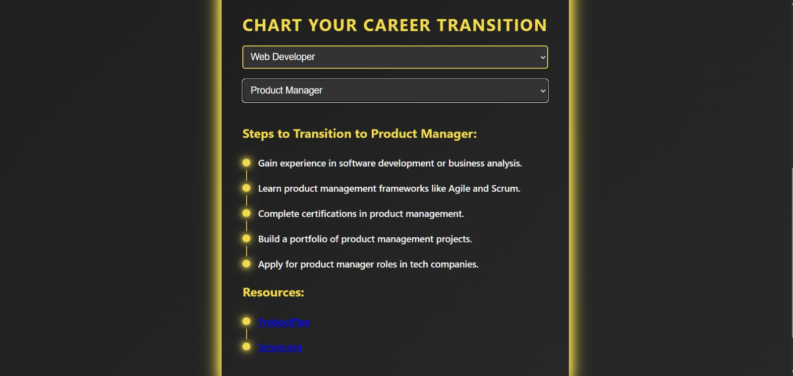

# 🎓 SPARK - Career Search & Recommendation Platform

A full-stack web application built using **Flask**, **PostgreSQL**, **HTML**, **CSS**, and **JavaScript** that helps students explore careers, courses, educational pathways, and related professions through an interactive and user-friendly platform.

---

# 📖 About

Choosing the right career is one of the biggest challenges students face. EDU was developed to simplify this process by providing a centralized platform where users can search professions, explore related career opportunities, browse career categories, and discover possible career transition pathways.

The application combines a responsive frontend with a Flask backend and PostgreSQL database to deliver dynamic search, recommendation, and information retrieval features.

---

# ✨ Features

- 🔍 Dynamic Career Search
- 📚 Detailed Profession Information
- 🔗 Related Career Recommendations
- 📈 Top Searched Careers
- 🎯 Career Categories
- 🔄 Career Transition Pathways
- 🤖 Smart Advisor
- 📧 Support & Contact System
- 🗄 PostgreSQL Database Integration
- ⚡ REST API Powered Backend

---

# 🌟 Project Highlights

- Full Stack Web Application
- Flask Backend
- PostgreSQL Relational Database
- SQLAlchemy ORM
- Dynamic Search Functionality
- Interactive User Interface
- Email Support Integration
- Career Recommendation System
- Modular Project Structure

---

# 🛠 Tech Stack

## Frontend
- HTML5
- CSS3
- JavaScript

## Backend
- Python
- Flask

## Database
- PostgreSQL
- SQLAlchemy

## Tools & Libraries
- Flask-Migrate
- Alembic
- Flask-Mail
- Python Dotenv
- Git
- GitHub

---

# 🚀 Main Modules

### 🔍 Explorer
Search careers and view detailed profession information.

### 🤖 Smart Advisor
Provides career guidance based on user exploration.

### 📚 Categories
Browse careers, courses, colleges, and examinations.

### 🔄 Transition Pathway
Explore possible career transition opportunities.

### 📄 Profession Details
Displays detailed profession information along with related careers.

### 📧 Support System
Allows users to submit support requests and receive confirmation emails.

---

# 💾 Database

The application uses PostgreSQL to manage:

- Profession Information
- Related Professions
- External Links
- User Support Requests

---

# 📷 Application Preview

<p align="center">


</p>

<p align="center">


</p>

<p align="center">


</p>

<p align="center">


</p>

<p align="center">


</p>

---

# 📂 Project Structure

```
EDU/
│
├── migrations/
├── static/
│   ├── css/
│   ├── js/
│   ├── images/
│   └── videos/
│
├── templates/
│
├── app1.py
├── requirements.txt
├── README.md
└── .gitignore
```

---

# ⚙️ Installation

Clone the repository

```bash
git clone https://github.com/SHIV0V/EDU.git
```

Move into the project folder

```bash
cd EDU
```

Install dependencies

```bash
pip install -r requirements.txt
```

Create a `.env` file

```env
DATABASE_URL=your_database_url
SECRET_KEY=your_secret_key
MAIL_USERNAME=your_email
MAIL_PASSWORD=your_app_password
```

Run the application

```bash
python app1.py
```

---


# 🗄 Database Architecture

The application uses a **PostgreSQL relational database** managed through **SQLAlchemy ORM**. The database is designed to efficiently manage profession information, career relationships, AI-based recommendations, external resource links, and user support requests.

```text
                           PostgreSQL Database
                                  │
        ┌─────────────────────────┼─────────────────────────┐
        │                         │                         │
        ▼                         ▼                         ▼
  professions           profession_relations            gmail
        │                         │
        │                         └── Stores relationships
        │                             between professions
        │
        ├──────────────┐
        │              │
        ▼              ▼
      link      Top Search Statistics
        │
        └── Stores external resources
            (College Links, Course Links,
             Career References, Websites)


                     AI Recommendation Module
                               │
                    ┌──────────┴──────────┐
                    │                     │
                    ▼                     ▼
                   ai                 ai_smpl
                                           │
                                           ▼
                                     ai_smpl_cors
                                           │
                                           ▼
                              ai_profession_relation
                                           │
                                           ▼
                                     professions
```

## Database Connectivity

The backend connects to PostgreSQL using **Flask SQLAlchemy**. All database operations are performed through ORM models, making the application scalable and maintainable.

### Database Workflow

```text
User
   │
   ▼
Frontend (HTML • CSS • JavaScript)
   │
   ▼
Flask Backend (app1.py)
   │
   ▼
SQLAlchemy ORM
   │
   ▼
PostgreSQL Database
```

## Database Tables

| Table | Purpose |
|--------|---------|
| **professions** | Stores profession, course, salary, descriptions, images, and other career-related information. |
| **profession_relations** | Maintains relationships between professions for recommendation purposes. |
| **link** | Stores external references such as college websites, course pages, and additional resources. |
| **gmail** | Stores user support requests submitted through the contact form. |
| **ai** | Stores AI recommendation keywords. |
| **ai_smpl** | Maps AI keywords with professions. |
| **ai_smpl_cors** | Connects AI recommendations with related courses. |
| **ai_profession_relation** | Stores AI-generated profession relationship data used for recommendations. |

### Database Features

- Relational database design using PostgreSQL
- SQLAlchemy ORM for database operations
- Profession recommendation mapping
- AI keyword-based recommendation support
- External educational resource management
- User support request management
- Scalable and modular database architecture


---

# 💡 Skills Demonstrated

- Full Stack Web Development
- Flask Framework
- REST API Development
- PostgreSQL Database Design
- SQLAlchemy ORM
- Dynamic Search Implementation
- JavaScript DOM Manipulation
- Responsive UI Development
- Email Integration
- Backend & Frontend Integration

---

# 🚀 Future Enhancements

- AI-Based Career Recommendation (level 2)
- User Authentication
- Admin Dashboard
- Resume Recommendation System
- Cloud Deployment
- Mobile Responsive Design
- Analytics Dashboard

---

# 👨‍💻 Developer

**Shiv.v**


---

## 📄 License

This project is intended for educational purposes.
